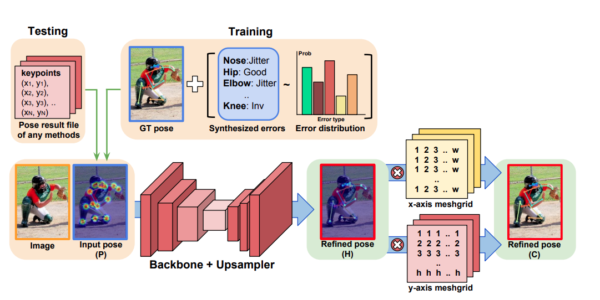
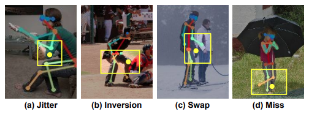
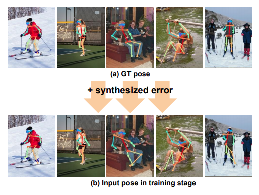
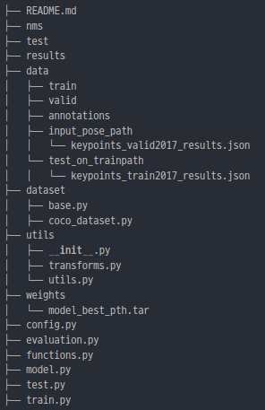

## **PoseFix** (feat. daram)
---

#### [개요]
- [[Paper]](https://arxiv.org/abs/1812.03595) | [[Code]](https://github.com/mks0601/PoseFix_RELEASE)
    
    - Pose Estimator가 아니라  `Refining을 하는  model-agnotic 모델`임.
    - 기존에 존재하던 Pose Refine 모델들은  Two-Stage였음 → Pose estimiator에 의존적 이었고 따라서 Refinment를 성공하기 위해서는 세심한 설계가 필요했음
    - 저자들은 Pose Estimator 모델 아키텍처와 상관 없이 성공적인 결과를 내는 모델을 만드는게 목적임
<br></br>
<br></br>

#### [학습 Keypoint]
- OKS(Object Keypoint Similarity), KS(Keypoint similarity), Jitter, Inversion, Swap, Miss와 같은 pose estimiaton 에러를 사용해 Synthesized한 데이터를 만들고 이를 학습에 활용하여 Pose Refinement model을 학습하였음.

    

    

- OKS
    - Object Keypoint Similarity로 COCO Dataset에서 정의한 metric
    - 예측한 keypoint와 GT keypoint와의 유사도를 측정하는 방법
    - $KS = exp{-{d_i}^2 \over 2s^2{k_i}^2}$

- Keypoint Similarity
- Jitter: estimator 결과가 in-approximat 안에 존재하지만 human error margin 밖에 존재할 때
- Inverseion: estimator 결과가 잘못된 신체 부위에 있는 경우
- Swap: estimator 결과가 다른 사람에게 존재
- Miss: estimator 결과가 in-approximat 안에 존재하지 않을 때
- [[Ref]](https://arxiv.org/abs/1707.05388) 해당 논문에 나오는 분포를 참고해서 Synthesized한 데이터 만들었음
    - frequency of each pose error(Jitter, Inversion, Swap, Miss) according to each pose error
    - the number of visible keypoints
    - overlap in the input image
<br></br>
<br></br>

#### [학습과정]
- 논문 구현을 중 `백본 모델만 ResNet-152가 아닌 ResNet-50으로 구현` 후 학습
- 논문 구현에서 거의 바꾸지 않고 학습한 후에 `original 모델의 결과보다 AP가 높게 나오기 시작해서`  daram에 얹은 후 결과 비교해 봤음 → 생각보다 결과가 좋지는 않았다.
- 결과가 좋지 않은 이유를 생각해 봤음
    - 해결해보자 하는 테스크
        1. 사람-사람 occlusion
        2. 사람-배경 occlusion

        사람-사람의 경우는 detection 자체가 안되는 경우가 많아서 `타깃으로 잡은 것은 2번의 사람-배경의 경우`인데  daram의 제공 환경이 주로 매장인 경우에 하체가 가려지는 경우가 상대적으로 많았고 해당 경우에 상반신만 포즈가 제대로 찍히는 것이 문제 였음.

        → 논문의 PoseFix는 confidence가 높은 경우에는 좋은 방향으로의 수정이 되었지만 낮은 경우는 여전히 별다른 성과를 보이지 못했음

    - Augmentation의 방법 변화
        - 원 논문은 Flip, Rotation, Synthesize 세 가지를 수행해줌
        - `추가적으로 하체(발목-무릎, 무릎-엉덩이) Keypoin의 인풋 길이를 80%까지 작게 해주고 cutout을 더해` 하체가 occlusion에의해 가려졌을 때 예측되는 경우를 가상 적으로 만들어 주었음 → **120/140Epochs 학습해봤지만 기존의 PoseFix보다 좋은 결과가 나오지는 않는다.**
<br></br>
<br></br>

#### [추론속도]
- FPS → 최저 27 samples/s   최대 30 samples/s
    - 테스트 환경
        - `CPU`: Intel(R) Core(TM) i7-10700 CPU @ 2.90GHz
        - `GPU`: GeForce RTX 2070 SUPER
        - `Memory`: 16GB
        - `Image size`: 384x288x3
        - `Batch`: 16

- 해당 추론 속도는 배치 사이즈가 확보 되었을 때 나오는 속도
    - `실제 daram에 얹어서 돌려본 결과 최대 9fps 최저 3fps`
    - Posefix인풋으로 original모델의 아웃풋 좌표들을 heatmap으로 매핑해줘야하는데 해당 부분에서 오래걸려서 그런 것으로 확인
<br></br>
<br></br>

ore값이 threshold를 넘는 디텍션 결과가 1~10개 정도 되는 것 같은데 PoseFix에서 한건한건 처리하면 너무 오래걸림 → 3fps정도 → 한번에 처리해주는 코드로 변경해줬는데 동일하게 3fps 나온다...
    - `gaussian 형태의 분포의 히트맵으로 인코딩하는 과정 및 추론 결과로 부터 coordinates를 뽑아내는 과정에서 각각 0.1, 0.08초 정도로  병목 발생`  → 모델의 추론과정 자체는 0.02s 정도 밖에 걸리지 않음
    - **히트맵 + 좌표추출 과정에서 병목만 해결된다면 필요한 경우에 사용하는 것은 가능해보인다**.

- [Best weight Keypoints AP result]
    - **[`[Baseline]](https://github.com/microsoft/human-pose-estimation.pytorch/blob/master/lib/core/function.py) → Microsoft - human-pose-estimation`**

        - Average Precision (AP) @[ IoU=0.50:0.95 | area= all | maxDets= 20 ] = 0.741
        - Average Precision (AP) @[ IoU=0.50 | area= all | maxDets= 20 ] = 0.926
        - Average Precision (AP) @[ IoU=0.75 | area= all | maxDets= 20 ] = 0.805
        - Average Precision (AP) @[ IoU=0.50:0.95 | area=medium | maxDets= 20 ] = 0.705
        - Average Precision (AP) @[ IoU=0.50:0.95 | area= large | maxDets= 20 ] = 0.796
        - Average Recall (AR) @[ IoU=0.50:0.95 | area= all | maxDets= 20 ] = 0.769
        - Average Recall (AR) @[ IoU=0.50 | area= all | maxDets= 20 ] = 0.932
        - Average Recall (AR) @[ IoU=0.75 | area= all | maxDets= 20 ] = 0.827
        - Average Recall (AR) @[ IoU=0.50:0.95 | area=medium | maxDets= 20 ] = 0.730
        - Average Recall (AR) @[ IoU=0.50:0.95 | area= large | maxDets= 20 ] = 0.826

    - [-] `Baseline` 이 더 좋은 결과
    - [+] `PoseFix` 가 더 좋은 결과 혹은 같은 수준

    - **`[PoseFix - w/  Flip]` → [배치: 32  |  Time taken: 396s]**
        - [+] Average Precision (AP) @[ IoU=0.50:0.95 | area= all | maxDets= 20 ] = 0.758
        - [-] Average Precision (AP) @[ IoU=0.50 | area= all | maxDets= 20 ] = 0.924
        - [+]Average Precision (AP) @[ IoU=0.75 | area= all | maxDets= 20 ] = 0.822
        - [+]Average Precision (AP) @[ IoU=0.50:0.95 | area=medium | maxDets= 20 ] = 0.726
        - [+]Average Precision (AP) @[ IoU=0.50:0.95 | area= large | maxDets= 20 ] = 0.806
        - [+]Average Recall (AR) @[ IoU=0.50:0.95 | area= all | maxDets= 20 ] = 0.787
        - [+]Average Recall (AR) @[ IoU=0.50 | area= all | maxDets= 20 ] = 0.932
        - [+]Average Recall (AR) @[ IoU=0.75 | area= all | maxDets= 20 ] = 0.840
        - [+]Average Recall (AR) @[ IoU=0.50:0.95 | area=medium | maxDets= 20 ] = 0.751
        - [+]Average Recall (AR) @[ IoU=0.50:0.95 | area= large | maxDets= 20 ] = 0.841

    - **`[PoseFix - w/o Filp]` → [배치: 32  |  Time taken: 220s]**

        - [+]Average Precision (AP) @[ IoU=0.50:0.95 | area= all | maxDets= 20 ] = 0.756
        - [-]Average Precision (AP) @[ IoU=0.50 | area= all | maxDets= 20 ] = 0.924
        - [+]Average Precision (AP) @[ IoU=0.75 | area= all | maxDets= 20 ] = 0.813
        - [+]Average Precision (AP) @[ IoU=0.50:0.95 | area=medium | maxDets= 20 ] = 0.724
        - [+]Average Precision (AP) @[ IoU=0.50:0.95 | area= large | maxDets= 20 ] = 0.803
        - [+]Average Recall (AR) @[ IoU=0.50:0.95 | area= all | maxDets= 20 ] = 0.785
        - [-]Average Recall (AR) @[ IoU=0.50 | area= all | maxDets= 20 ] = 0.931
        - [+]Average Recall (AR) @[ IoU=0.75 | area= all | maxDets= 20 ] = 0.839
        - [+]Average Recall (AR) @[ IoU=0.50:0.95 | area=medium | maxDets= 20 ] = 0.748
        - [+]Average Recall (AR) @[ IoU=0.50:0.95 | area= large | maxDets= 20 ] = 0.839
<br></br>
<br></br>


#### [디렉터리 구조]

<br></br>
input_pose_path와 test_on_trainpath의 하위 json파일은 weight 파일과 함께 공유
<br></br>
<br></br>


#### [사용법]
- Train
``` shell
    python3 train.py --train_batch --test_batch --flip_test
```

- Test
``` shell
    python3 test.py --checkpoint --test_batch --flip_test --video_path --detection_json
```
